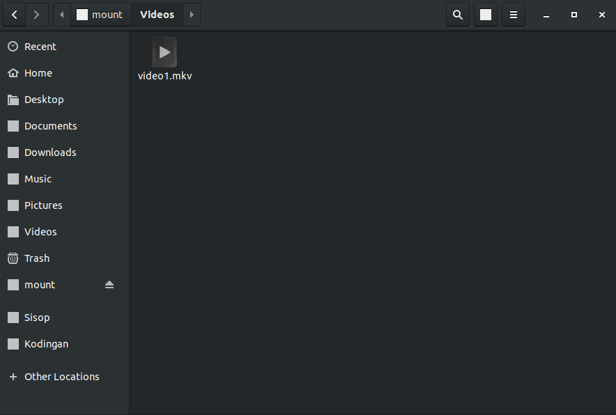
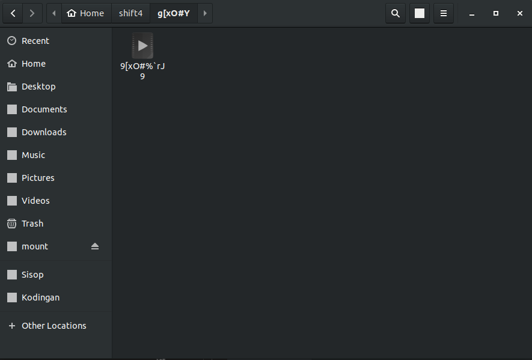
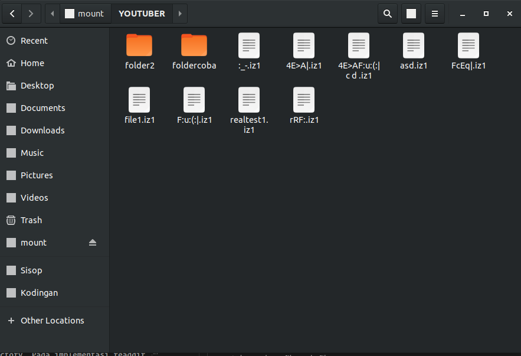
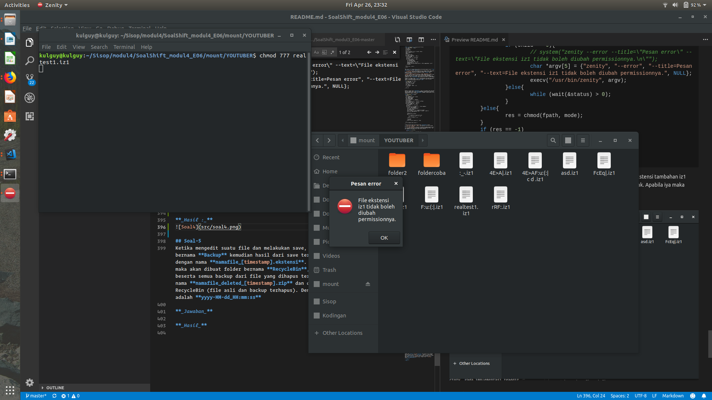
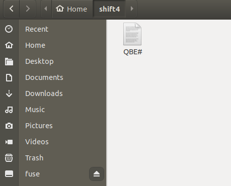
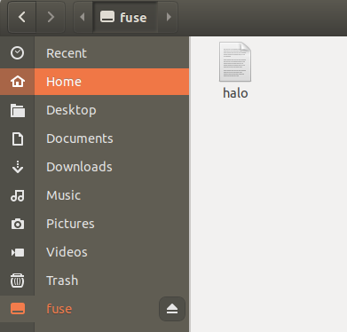
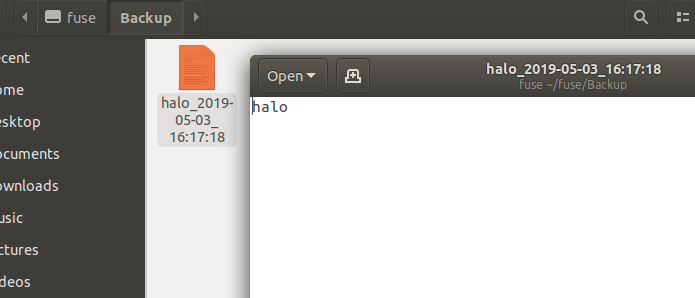
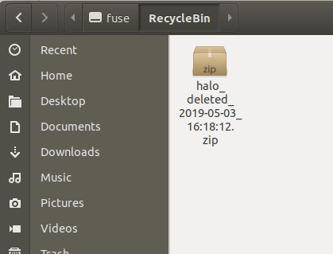

# Soal Shift Modul 4 (Kelompok E6)

###### Nama Anggota :
1. Ifta Jihan Nabila (05111740000034)
2. Komang Yogananda MW (05111740000114)

**Penjelasan Soal Shift Modul 4 Sistem Operasi 2019:**
* [Soal 1](#Soal-1)
* [Soal 2](#Soal-2)
* [Soal 3](#Soal-3)
* [Soal 4](#Soal-4)
* [Soal 5](#Soal-5)

## Soal-1
Semua nama file dan folder harus terenkripsi
Enkripsi yang Atta inginkan sangat sederhana, yaitu Caesar cipher. Namun, Kusuma mengatakan enkripsi tersebut sangat mudah dipecahkan. Dia menyarankan untuk character list diekspansi,tidak hanya alfabet, dan diacak. Berikut character list yang dipakai:

```
qE1~ YMUR2"`hNIdPzi%^t@(Ao:=CQ,nx4S[7mHFye#aT6+v)DfKL$r?bkOGB>}!9_wV']jcp5JZ&Xl|\8s;g<{3.u*W-0
```
      
**_Jawaban:_** 

Untuk enkripsi suatu folder dan file maka kami membuat fungsi **enc** untuk enkripsi dan **dec** untuk dekripsi

pertama inisialisasi variabel **list** untuk menyimpan character list yang dipakai 
```c
char list[100] = "qE1~ YMUR2\"`hNIdPzi%^t@(Ao:=CQ,nx4S[7mHFye#aT6+v)DfKL$r?bkOGB>}!9_wV']jcp5JZ&Xl|\\8s;g<{3.u*W-0";
```

Character list tersebut memiliki 94 character. Dan key yang dipakai adalah **17** yang berarti jika di enkripsi, maka akan bergeser ke kanan sebanyak 17. Dan jika didekripsi akan bergeser ke kanan sebanyak banyak karakter pada list (94) dikurangi key yang dipakai (17), maka 94-17=77.

Berikut ini merupakan fungsi untuk enkripsi
```c
void enc(char* encrypt)
{
	if(!strcmp(encrypt,".") || !strcmp(encrypt,"..")) return;
	int enkripsi = strlen(encrypt);
	for(int i=0;i<enkripsi;i++)
	{
		for(int j=0;j<94;j++)
		{
			if(encrypt[i]==list[j])
			{
				encrypt[i] = list[(j+17)%94];
				break;
			}
		}
	}
}
```

variabel **encrypt** merupakan string yang akan dienkripsi. apabila _encrypt ke-i_ sama dengan _list ke-j_ maka variabel _encrypt ke-i_ akan diubah menjadi _list ke-j + 17 % 94_.

Fungsi untuk dekripsi
```c
void dec(char* decrypt)
{
	if(!strcmp(decrypt,".") || !strcmp(decrypt,"..")) return;
	int dekripsi = strlen(decrypt);
	for(int i=0;i<dekripsi;i++)
	{
		for(int j=0;j<94;j++){
			if(decrypt[i]==list[j]){
				decrypt[i] = list[(j+77)%94];
				break;
			}
		}
	}
}
```

variabel **decrypt** merupakan string yang akan didekripsi. apabila _decrypt ke-i_ sama dengan _list ke-j_ maka variabel _decrypt ke-i_ akan diubah menjadi _list ke-j + 77 % 94_.

Selanjutnya fungsi enkripsi dan dekripsi tersebut akan dipanggil dalam xmp_readdir dan xmp_getattr dan yang lainnya sesuai permintaan soal.
Pemanggilan fungsi dekripsi pada xmp_readdir akan menampilkan nama file di folder tujuan yang telah didekripsi.
Sedangkan pada xmp_getattr pemanggilan fungsi enkripsi agar file dapat menemukan lokasi aslinya dengan nama sebelumnya (awal).


## Soal-2
Semua file video yang tersimpan secara terpecah-pecah (splitted) harus secara otomatis tergabung (joined) dan diletakkan dalam folder “Videos”
Urutan operasi dari kebutuhan ini adalah:
1.  Tepat saat sebelum file system di-mount
    - Secara otomatis folder “Videos” terbuat di root directory file system
    - Misal ada sekumpulan file pecahan video bernama “computer.mkv.000”, “computer.mkv.001”, “computer.mkv.002”, dst. Maka secara otomatis file pecahan tersebut akan di-join menjadi file video “computer.mkv”. Untuk mempermudah kalian, dipastikan hanya video file saja yang terpecah menjadi beberapa file. File pecahan tersebut dijamin terletak di root folder fuse
    - Karena mungkin file video sangat banyak sehingga mungkin saja saat menggabungkan file video, file system akan membutuhkan waktu yang lama untuk sukses ter-mount. Maka pastikan saat akan menggabungkan file pecahan video, file system akan membuat 1 thread/proses(fork) baru yang dikhususkan untuk menggabungkan file video tersebut
    - Pindahkan seluruh file video yang sudah ter-join ke dalam folder “Videos”
    - Jangan tampilkan file pecahan di direktori manapun
2. Tepat saat file system akan di-unmount
    - Hapus semua file video yang berada di folder “Videos”, tapi jangan hapus file pecahan yang terdapat di root directory file system
    - Hapus folder “Videos” 

**_Jawaban_**  

Pertama-tama operasi fuse **init** harus diimplementasikan sendiri pada program fuse untuk melakukan permintaan Tepat saat sebelum file system di mount.  
Implementasi **init** dapat dilihat dibawah.
```c
static void xmp_init(struct fuse_conn_info *conn){
	char videos[1000] = "Videos";
	enc(videos);
	enc(youtuber);
	enc(filemiris);
	enc(iz1);
	sprintf(videosPath, "%s/%s", dirpath, videos);
	mkdir(videosPath, 0777);
	counter = 0;
	DIR* dp;
	struct dirent *de;
	dp = opendir(dirpath);
	while((de = readdir(dp)) != NULL){
		char temp[1000];
		sprintf(temp, "%s", de->d_name);
		dec(temp);
		printf("init temp %s\n", temp);
		if (isVideo(temp)){
			char namadepan[1000];
			int len = strlen(temp);
			sprintf(namadepan, "%s", temp);
			namadepan[len - 4] = '\0';
			pthread_create(&(buruhVideo[counter++]), NULL, &gabungVideo, (void *)namadepan);
		}
	}
	printf("%d\n", counter);
	return;
}
```
Pada fungsi init terdapat beberapa bagian penting dalam memenuhi syarat **Tepat saat sebelum file system di mount**:  
1. `dp = opendir(dirpath)` yaitu membuka directory tempat pecahan video berada
2. `isVideo(temp)` digunakan untuk memeriksa apakah sebuah file merupakan pecahan video awal bernomor 000. Implementasi fungsi **isVideo** akan dijelaskan dibawah.
3. `pthread_create(&(buruhVideo[counter++]), NULL, &gabungVideo, (void *)namadepan)` apabila sebuah file dinyatakan sebagai sebuah awalan pecahan video, maka nama depan dari file tersebut (contoh video1.mkv.000, namadepan = video1.mkv) akan diberikan kepada sebuah thread untuk digabung. Penggabungan menggunakan fungsi **gabungVideo** yang implementasinya akan dijelaskan dibawah.

Dibawah ini merupakan fungsi **isVideo** yang digunakan untuk memeriksa apakah sebuah file merupakan pecahan video. Intinya fungsi ini memeriksa apakah namafile yang diperiksa memiliki ekstensi **.000**.
```c
int isVideo(const char *path){
	char temp[1000];
	sprintf(temp, "%s", path);
	int len = strlen(temp);
	char *ext;
	ext = &temp[len - 4];
	if (strcmp(ext, ".000") == 0){
		return 1;
	}
	return 0;
}
```

Kemudian terdapat fungsi **gabungVideo**. Fungsi ini merupakan fungsi yang akan diberikan kepada sebuah thread untuk menggabungkan pecahan pecahan video yang sudah dinyatakan valid. Fungsi **gabungVideo** mengambil sebuah parameter yaitu namadepan dari sebuah file pecahan.
```c
void *gabungVideo(void *param){
	DIR *dp;
	struct dirent *de;
	char *namadepan = (char *) param;
	dp = opendir(dirpath);
	char newVideo[1000];
	char encVideo[1000];
	sprintf(encVideo, "%s", namadepan);
	enc(encVideo);
	sprintf(newVideo, "%s/%s", videosPath, encVideo);
	creat(newVideo, 0777);
	printf("gabung video %s\n", newVideo);
	while((de = readdir(dp)) != NULL){
		char temp[1000];
		sprintf(temp, "%s", de->d_name);
		dec(temp);
		printf("part file %s compare %s \n", temp, namadepan);
		if (strstr(temp, namadepan)){
			FILE *fp = fopen(newVideo, "a+");
			printf("part file status ok");
			char namafile[1000];
			sprintf(namafile, "%s/%s", dirpath, de->d_name);
			printf(" opening %s file and begin to copying ", namafile);
			FILE *fp2 = fopen(namafile, "r");
			
			size_t n, m;
			unsigned char buff[8192];
			do {
					n = fread(buff, 1, sizeof buff, fp2);
					if (n) m = fwrite(buff, 1, n, fp);
					else   m = 0;
			} while ((n > 0) && (n == m));
			
			fclose(fp2);
			fclose(fp);
			printf("\nsucces copying %s\n", temp);
		}
	}
	printf("gabung video selesai\n");
}
```
Terdapat beberapa bagian penting pada fungsi **gabungVideo** diatas.
1.  `while((de = readdir(dp)) != NULL)` untuk menelusuri seluruh file dalam directory root filesystem.
2. `strstr(temp, namadepan)` digunakan untuk memeriksa apakah sebuah directory entry merupakan bagian pecahan lain dari sebuah video yang akan dibuat. temp dan namadepan dicek dengan format yang telah di dekripsi.
3. ```c
    unsigned char buff[8192];
    do {
        n = fread(buff, 1, sizeof buff, fp2);
        if (n) m = fwrite(buff, 1, n, fp);
        else   m = 0;
    } while ((n > 0) && (n == m));

    fclose(fp2);
    fclose(fp);
    ```
    bagian ini digunakan untuk memindahkan seluruh data dari pecahan video yang ditemukan, kemudian me-appendnya dengan file asli yang sedang dibuat. **fp** adalah file asli yang sedang dibuat, **fp2** merupakan file pecahan video yang sedang dideteksi.

**_Hasil_**  
   
 


## Soal-3
Sebelum diterapkannya file system ini, Atta pernah diserang oleh hacker LAPTOP_RUSAK yang menanamkan user bernama “chipset” dan “ic_controller” serta group “rusak” yang tidak bisa dihapus. Karena paranoid, Atta menerapkan aturan pada file system ini untuk menghapus “file bahaya” yang memiliki spesifikasi:
- Owner Name    : ‘chipset’ atau ‘ic_controller’
- Group Name    : ‘rusak’
- Tidak dapat dibaca  

Jika ditemukan file dengan spesifikasi tersebut ketika membuka direktori, Atta akan menyimpan nama file, group ID, owner ID, dan waktu terakhir diakses dalam file “filemiris.txt” (format waktu bebas, namun harus memiliki jam menit detik dan tanggal) lalu menghapus “file bahaya” tersebut untuk mencegah serangan lanjutan dari LAPTOP_RUSAK.
 
 **_Jawaban_**
 
Fungsi **eksekusiBahaya** digunakan untuk memeriksa apakah suatu file berbahaya atau tidak dan sekaligus menghapus dan menulis lognya apabila dinyatakan berbahaya.  
Fungsi **eksekusiBahaya** akan selalu dipanggil saat melakukan readdir suatu directory entry.
```c
void eksekusiBahaya(const char *path, const char* name){
	struct stat stat;
	lstat(path, &stat);
	struct passwd *pwd = getpwuid(stat.st_uid);
	struct group *grp = getgrgid(stat.st_gid);
	int ans = 0;
	if (strcmp(pwd->pw_name, "ic-controller") == 0 || strcmp(pwd->pw_name, "chipset") == 0){
		if (strcmp(grp->gr_name, "rusak") == 0){
			if (access(path, R_OK) != 0){
				ans = 1;
			}
		}
	}
	printf("eksekusi berbahaya %s %s %s %d\n", path, pwd->pw_name, grp->gr_name, ans);
	if (ans == 1){
		FILE *fp;
		struct tm *tm;
		char buf[200];
		time_t t = stat.st_atime;
		tm = localtime(&t);
		strftime(buf, sizeof(buf), "%d.%m.%Y %H:%M:%S", tm);
		char filemirispath[1000];
		sprintf(filemirispath, "%s/%s", dirpath, filemiris);
		printf("filemirispath %s\n", filemirispath);
		fp = fopen(filemirispath, "a");
		fprintf(fp, "%s %s %s %s\n", name, grp->gr_name, pwd->pw_name, buf);
		fclose(fp);
		remove(path);
	}
}
```
Hal penting yang terdapat pada fungsi **eksekusiBahaya** yaitu:
1. ```c
    struct stat stat;
	lstat(path, &stat);
	struct passwd *pwd = getpwuid(stat.st_uid);
	struct group *grp = getgrgid(stat.st_gid);
   ```
   Potongan kode diatas digunakan untuk mengambil stat dari sebuah file. Stat nantinya akan mengandung uid dan gid yang dapat digunakan untuk mencari nama user dan group file tersebut.
2. ```c
    if (strcmp(pwd->pw_name, "ic-controller") == 0 || strcmp(pwd->pw_name,  "chipset") == 0){
      if (strcmp(grp->gr_name, "rusak") == 0){
        if (access(path, R_OK) != 0){
          ans = 1;
        }
      }
    }
   ```
   Potongan kode diatas digunakan untuk memeriksa apakah suatu file berbahaya atau tidak. Tingkat pertama memeriksa apakah user bernama **ic-controller** atau **chipset**. Tingkat kedua memeriksa apakah file tersebut berada pada group **rusak**. Tingkat ketiga memeriksa apakah file tersebut bisa dibaca atau tidak. Apabila ketiga hal tersebut terpenuhi maka akan ditandai.
3. ```c
    fp = fopen(filemirispath, "a");
		fprintf(fp, "%s %s %s %s\n", name, grp->gr_name, pwd->pw_name, buf);
		fclose(fp);
		remove(path);
   ```
   Potongan program tersebut digunakan untuk mengeksekusi file berbahaya. Pertama melakukan log terlebih dahulu kemudian menghapus file tersebut.
  


## Soal-4
Pada folder **YOUTUBER**, setiap membuat folder permission foldernya akan otomatis menjadi 750. Juga ketika membuat file permissionnya akan otomatis menjadi 640 dan ekstensi filenya akan bertambah “.iz1”. File berekstensi “.iz1” tidak bisa diubah permissionnya dan memunculkan error bertuliskan “File ekstensi iz1 tidak boleh diubah permissionnya.”

**_Jawaban_**  
Pada soal ini terdapat 4 operasi yang dirombak secara besar, yaitu **mkdir**, **readdir**, **create**, **chmod**.

```c
static int xmp_mkdir(const char *path, mode_t mode)
{
	int res;
	char fpath[1000];
	char name[1000];
	sprintf(name,"%s",path);
	enc(name);
	sprintf(fpath, "%s%s",dirpath,name);
	printf("mkdir %s\n", fpath);
	if (strstr(fpath, youtuber)){
		res = mkdir(fpath, 0750);
	}else{
		res = mkdir(fpath, mode);
	}
	if (res == -1)
		return -errno;

	return 0;
}
```
**mkdir** digunakan untuk membuat sebuah folder. Pada fungsi **mkdir** ini terdapat kondisi khusus untuk soal nomor 4.
- ```c
  if (strstr(fpath, youtuber)){
		res = mkdir(fpath, 0750);
	}
  ```
  Apabila "/YOUTUBER" terdeteksi pada path directory dari directory yang akan dibuat, maka mode directory akan diubah menjadi 0750.

**Readdir**
```c
static int xmp_readdir(const char *path, void *buf, fuse_fill_dir_t filler,
		       off_t offset, struct fuse_file_info *fi){
	int res;
  DIR *dp;
	struct dirent *de;

	(void) offset;
	(void) fi;
	char fpath[1000];
	char name[1000];
	if (strcmp(path, "/") == 0){
		sprintf(fpath, "%s", dirpath);
	}else{
		sprintf(name,"%s",path);
		enc(name);
		sprintf(fpath, "%s%s",dirpath,name);
	}
	dp = opendir(fpath);
	if (dp == NULL)
		return -errno;

	while ((de = readdir(dp)) != NULL) {
		struct stat st;
		memset(&st, 0, sizeof(st));
		st.st_ino = de->d_ino;
		st.st_mode = de->d_type << 12;
		char fullpathname[1000];
		sprintf(fullpathname, "%s/%s", fpath, de->d_name);
		char temp[1000];
		strcpy(temp,de->d_name);
		dec(temp);
		printf("path %s fpath %s youtuber %s fpname %s\n", path, fpath, youtuber, fullpathname);
		char getExt[1000];
		sprintf(getExt, "%s", temp);
		char *ext = &getExt[strlen(getExt) - 3];
		int bil = atoi(ext);
		if ((bil > 0 && bil < 1000) || strcmp(ext, "000") == 0){
			continue;
		}else if (strstr(fpath, youtuber) && de->d_type == DT_REG){
			char newPathName[1000];
			sprintf(newPathName, "%s.iz1", temp);
			res = (filler(buf, newPathName, &st, 0));
			eksekusiBahaya(fullpathname, newPathName);
		}else{
			res = (filler(buf, temp, &st, 0));
			eksekusiBahaya(fullpathname, temp);
		}
			if(res!=0) break;
	}

	closedir(dp);
	return 0;
}
```
**readdir** digunakan untuk membaca sebuah directory. Pada implementasi readdir terdapat kondisi khusus untuk membaca file pada file **YOUTUBER**.
- ```c
  else if (strstr(fpath, youtuber) && de->d_type == DT_REG){
    char newPathName[1000];
    sprintf(newPathName, "%s.iz1", temp);
    res = (filler(buf, newPathName, &st, 0));
    eksekusiBahaya(fullpathname, newPathName);
  }
  ```
  Conditional statement tersebut bekerja untuk memeriksa apakah "/YOUTUBER" terdapat pada path dan directory entry yang dibaca merupakan file biasa, maka file tersebut akan ditampilkan dengan menambahkan ekstensi tambahan **iz1**.

**Create**
```c
static int xmp_create(const char* path, mode_t mode, struct fuse_file_info* fi) {
	(void) fi;

	int res;
	char fpath[1000];
	char name[1000];
	sprintf(name,"%s",path);
	enc(name);
	sprintf(fpath, "%s%s",dirpath,name);
	printf("create %s\n", fpath);
	if (strstr(fpath, youtuber)){
		res = creat(fpath, 0640);
	}else{
		res = creat(fpath, mode);
	}
	if(res == -1)
		return -errno;

	close(res);
	return 0;
}
```
Pada implementasi create, karena setiap file yang dibentuk pada folder **YOUTUBER** akan memiliki permission 640 maka terdapat conditial statement tersendiri.
- ```c
  if (strstr(fpath, youtuber)){
		res = creat(fpath, 0640);
	}
  ```

**Chmod**
```c
static int xmp_chmod(const char *path, mode_t mode)
{
	int res;
	char fpath[1000];
	char name[1000];
	sprintf(name,"%s",path);
	enc(name);
	sprintf(fpath, "%s%s",dirpath,name);
	struct stat statt;
	lstat(fpath, &statt);
	if (strstr(fpath, youtuber) && S_ISREG(statt.st_mode)){
		pid_t child = fork();
		int status;
		if (child == 0){
			// system("zenity --error --title=\"Pesan error\" --text=\"File ekstensi iz1 tidak boleh diubah permissionnya.\n\"");
			char *argv[5] = {"zenity", "--error", "--title=Pesan error", "--text=File ekstensi iz1 tidak boleh diubah permissionnya.", NULL};
			execv("/usr/bin/zenity", argv);
		}else{
			while (wait(&status) > 0);
		}
	}else{
		res = chmod(fpath, mode);	
	}
	if (res == -1)
		return -errno;

	return 0;
}
```
Pada implementasi chmod karena semua file pada folder **YOUTUBER** memiliki ekstensi tambahan iz1 maka hanya perlu memeriksa apakah berada didalam folder **YOUTUBER** atau tidak. Apabila iya maka mengeluarkan error dengan menggunakan execv.

**_Hasil :_**



## Soal-5
Ketika mengedit suatu file dan melakukan save, maka akan terbuat folder baru bernama **Backup** kemudian hasil dari save tersebut akan disimpan pada backup dengan nama **namafile_[timestamp].ekstensi**. Dan ketika file asli dihapus, maka akan dibuat folder bernama **RecycleBin**, kemudian file yang dihapus beserta semua backup dari file yang dihapus tersebut (jika ada) di zip dengan nama **namafile_deleted_[timestamp].zip** dan ditaruh ke dalam folder RecycleBin (file asli dan backup terhapus). Dengan format **[timestamp]** adalah **yyyy-MM-dd_HH:mm:ss**

**_Jawaban_**
Bagian pertama yaitu untuk backup file yang telah diedit dan juga disave. Berikut ini fungsi **xmp_write()**

```c
static int xmp_write(const char *path, const char *buf, size_t size, off_t offset, struct fuse_file_info *fi)
{
	int fd;
	int res;
    	char fpath[1000];
    	char name[1000];
    	char temp[1000];
	sprintf(name,"%s",path);
    	enc(name);
	if(strcmp(path,"/") == 0)
	{
		path=dirpath;
		sprintf(fpath,"%s",path);
	}
	else sprintf(fpath, "%s%s",dirpath,name);
	
	(void) fi;
	fd = open(fpath, O_WRONLY);
	if (fd == -1)
		return -errno;

	res = pwrite(fd, buf, size, offset);
	if (res == -1)
		res = -errno;

	close(fd);
	
	strcpy(temp,path); enc(temp);
	sprintf(name, "%s/%s", dirpath,temp);
	
		if(access(name, R_OK)<0)				
		return res;
	
	char fd_backup[1000]="/home/jihan/shift4/XB.Jhu";
	mkdir(fd_backup, 0777);
	
	char namafile[1000], ext[100], waktu[1000], filejadi[1000];
	
	int posisi_ext = posisi(path,'.');
	
	if (posisi_ext==0) {
		posisi_ext = strlen(path);
		ext[0] = '\0';
	}
	else{
		strcpy(ext, path+posisi_ext);
	}
	int posisi_slash = posisi(path, '/');
	int dot = posisi_ext-(posisi_slash+1);
	strncpy(namafile, path+1+posisi_slash, dot);
	namafile[dot] = '\0';
	
	time_t t = time(NULL);
	struct tm tm = *localtime(&t);
	sprintf(waktu, "%04d-%02d-%02d_%02d:%02d:%02d", tm.tm_year + 1900, tm.tm_mon + 1, tm.tm_mday, tm.tm_hour, tm.tm_min, tm.tm_sec);

	sprintf(filejadi, "%s_%s", namafile, waktu); 
	strcat(filejadi, ext);	
	enc(filejadi);
	sprintf(name, "%s%s", dirpath, temp);
	
	char final[1000];
	sprintf(final, "%s/%s", fd_backup, filejadi);

	int status;
	if (fork()==0)
		execlp("cp","cp", name, final, NULL);

	while((wait(&status))>0);
	
	return res;
}
```

Pada fungsi tersebut pertama akan membuat folder backup
```c
char fd_backup[1000]="/home/jihan/shift4/XB.Jhu";
	mkdir(fd_backup, 0777);
```

lalu terdapat fungsi **posisi** untuk mendapatkan dimana posisi char untuk slash '/' dan '.'. Fungsi ini dibutuhkan agar nanti kita akan mendapatkan nama file saja dan ekstensinya saja.
Berikut ini fungsi **posisi**

```c
int posisi(char *s, char ch){
	char *a = NULL;
	char *b = strchr(s, ch);

 	while(b != NULL){
		a = b;
 		b = strchr(b+1, ch);
	}
	if(a==NULL)
		return 0;

 	return (int) (a-s);
 }
```

Setelah mendapatkan nama file saja tanpa ekstensi yang disimpan ke dalam variabel **namafile** kita juga akan menyimpan waktu saat ini kedalam variabel **waktu** dengan format yang telah ditentukan.
```c
time_t t = time(NULL);
struct tm tm = *localtime(&t);
sprintf(waktu, "%04d-%02d-%02d_%02d:%02d:%02d", tm.tm_year + 1900, tm.tm_mon + 1, tm.tm_mday, tm.tm_hour, tm.tm_min, tm.tm_sec);
```

Lalu kita juga akan menyimpan ekstensi dari sebuah file ke dalam variabel **ext**, dan akan digabungkan dengan format namafile_waktu_ext dan disimpan pada variabel **filejadi** lalu akan dienkripsi. Setelah itu akan copy path file yang asli dengan path file jadi yang sekarang ke dalam folder backup.
```c
sprintf(name, "%s%s", dirpath, temp);	
char final[1000];
sprintf(final, "%s/%s", fd_backup, filejadi);

int status;
if (fork()==0)
	execlp("cp","cp", name, final, NULL);

while((wait(&status))>0);
```

Bagian kedua, yaitu apabila ada file yang dihapus maka akan dibuatkan folder RecycleBin. Kemudian file yang dihapus beserta semua backup dari file yang dihapus tersebut (jika ada) di zip dengan format yang telah ditentukan dan ditaruh ke dalam folder RecycleBin (file asli dan backup terhapus).
Terdapat pada fungsi xmp_unlink()
```c
static int xmp_unlink(const char *path)
{
	char fpath[1000], temp[1000];
	strcpy(temp, path);
	enc(temp);

	if(strcmp(temp,"/") == 0)
	{
		path=dirpath;
		sprintf(fpath,"%s",path);
	}
	else sprintf(fpath, "%s%s",dirpath,temp);

	int res, status;

	if(access(fpath, F_OK)<0)			
		return 0;

	char soal[1000], soal2[1000], waktu[100], file_zip[1000], fileasli[1000], ext[1000],
			namafile[1000];
	
	char fd_recyclebin[100]="/home/jihan/shift4/oO.k.EOX[)";
	mkdir(fd_recyclebin, 0777);

	int posisi_ext = posisi(path, '.');
	
	if (posisi_ext==0)
		posisi_ext = strlen(path);
	else{
		strcpy(ext, path+posisi_ext);
	}
	strcpy(fileasli, path);
	enc(fileasli);	

	int posisi_slash = posisi(path, '/');
	int dot = posisi_ext-(posisi_slash+1);
	strncpy(namafile, path+1+posisi_slash, dot);
	namafile[dot] = '\0';

	time_t t = time(NULL);
	struct tm tm = *localtime(&t);
	sprintf(waktu, "%04d-%02d-%02d_%02d:%02d:%02d", tm.tm_year + 1900, tm.tm_mon + 1, tm.tm_mday, tm.tm_hour, tm.tm_min, tm.tm_sec);

	sprintf(file_zip, "%s_deleted_%s", namafile, waktu);
	char zip_temp[1000], file_zip_temp[1000]; 
	char zip[100]="`S[u";
	enc(file_zip);
	enc(namafile);
	
	sprintf(file_zip_temp, "%s.zip", file_zip);
	sprintf(zip_temp, "%s%s", file_zip, zip);

	char backup[100] = "XB.Jhu"; char recycle[100]= "oO.k.EOX[)";
	sprintf(soal, "cd %s && zip '%s/%s' '%s' '%s/%s'* && rm -f '%s/%s'*", dirpath, recycle, file_zip, fileasli, backup, namafile, backup, namafile);
	sprintf(soal2, "%s && cp '%s/%s' '%s/%s' && rm -f '%s/%s'", soal, recycle, file_zip_temp, recycle, zip_temp, recycle, file_zip_temp); 
	if (fork()==0)
		execlp("bash","bash", "-c", soal2, NULL);

		while((wait(&status))>0);


	res = unlink(fpath);
	
	if (res == -1)
		return -errno;

	return 0;
}
```

Pertama, akan membuat folder RecycleBin
```c
char fd_recyclebin[100]="/home/jihan/shift4/oO.k.EOX[)";
mkdir(fd_recyclebin, 0777);
```

Lalu sama seperti pada fungsi write, yang juga menggunakan fungsi **posisi**, kita akan mendapatkan namafile tanpa ekstensi dan waktu sekarang. 
Setelah itu gabungkan namafile zip tersebut dengan format namafile_deleted_waktu lalu dienkripsi dan akan disimpan di variabel **file_zip**.

Karena nanti file zip tersebut akan di zip dari folder shift4, maka ekstensinya yaitu .zip. Kita akan buat terlebih dahulu variabel **file_zip_temp** yang merupakan **file_zip** dengan ekstensi _.zip_. Dan variabel **zip_temp** yang merupakan **file_zip** dengan ekstensi .zip yang telah dienkripsi.

Setelah itu execute command yang telah kami buat seperti berikut
```c
sprintf(soal, "cd %s && zip '%s/%s' '%s' '%s/%s'* && rm -f '%s/%s'*", dirpath, recycle, file_zip, fileasli, backup, namafile, backup, namafile);
sprintf(soal2, "%s && cp '%s/%s' '%s/%s' && rm -f '%s/%s'", soal, recycle, file_zip_temp, recycle, zip_temp, recycle, file_zip_temp); 
if (fork()==0)
	execlp("bash","bash", "-c", soal2, NULL);

	while((wait(&status))>0);

```

Pada variabel **soal** digunakan untuk membuat zip pada folder RecycleBin nantinya dan akan menghapus semua file backup dari file yang telah dihapus (jika ada). Karena ekstensi .zip belum terenkripsi, maka dibuatkan variabel **soal2** yang digunakan untuk copy zip yang sudah ada dengan zip yang sudah memiliki ekstensi .zip yang telah terenkripsi sehingga saat kita lihat pada filesystem file nya sudah terdekripsi dengan benar. Lalu zip yang lama akan dihapus.

**_Hasil:_**




Apabila file diedit



Apabila file dihapus




